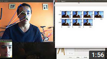
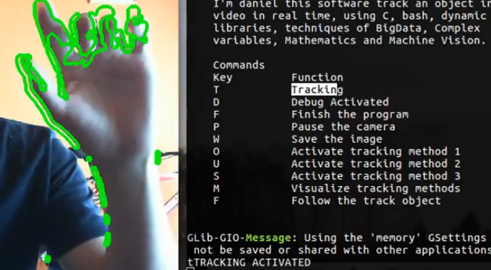
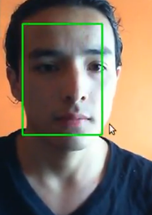
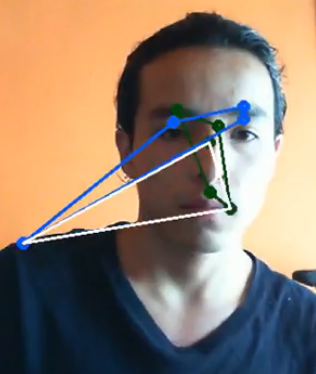

***Tracking Software***
============================================

This is a software that track custom images, in the video shown below the custom image is a face but can track the custom image that you desire. 

Video
=====

    

How to use it?
=============

    Commands
    Key         Function
    T           Tracking Movement
    D           Debug Activated
    F           Finish the program
    P           Pause the camera
    W           Save the image
    O           Activate tracking method 1 
    U           Activate tracking method 2
    S           Activate tracking method 3
    M           Visualize tracking methods
    F           Follow the track object

To use the keys O,U,S first crop an image.

Some examples
=============

#### Detect Movement

#### Track custom image

#### Track features

Author
=====

* Name : Daniel Santos
* Email : dfsantosbu@unal.edu.co
* Web : https://danielsantos.net

License
=======

GPL V3

